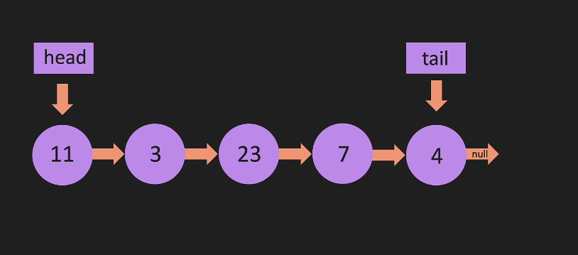
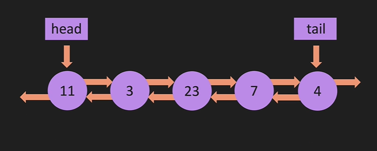
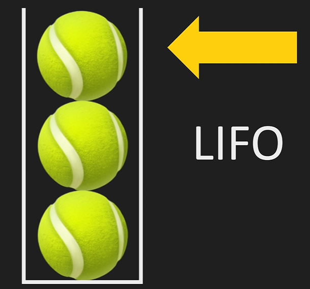
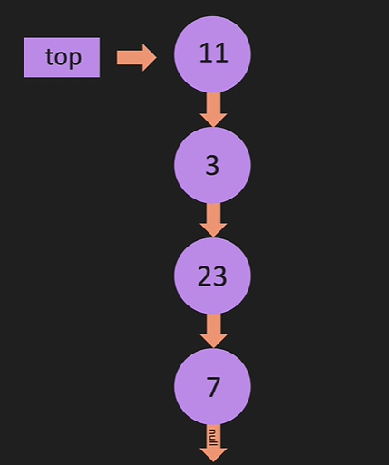
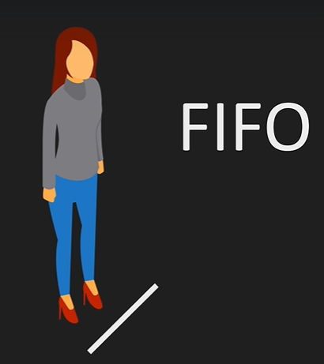
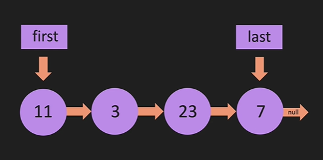

<h1 align="center">Implementation of DSA with JS 🔥</h1>

- [Singly Linked List](#linkedlist)  
- [Doubly Linked List](#doubly-linkedlist)  
- [Stack](#stack)  
- [Queue](#queue)  

<hr/>
<h2 align="center">LinkedList</h2>

> A linked list is a linear data structure consisting of a group of nodes where each node points to the next node by using a pointer. 


```js
class Node {
    constructor(value) {
        this.value = value;
        this.next = null;
    }
}

class LinkedList {
    constructor(value) {
        const newNode = new Node(value);
        this.head = newNode;
        this.tail = this.head;
        this.length = 1;
    }
    // Insert at the end of the list
    push(value) {
        // Create new node
        let newNode = new Node(value);
        // If there is no head, make new node the head and tail
        if (!this.head) {
            this.head = newNode;
            this.tail = newNode;
        } else {
            // Otherwise, insert new node at the end
            this.tail.next = newNode;
            this.tail = newNode;
        }
        // Increment length
        this.length++;
        return this;
    }
    // Remove from the end of the list
    pop() {
        // If there is no head, return undefined
        if (!this.head) return undefined
        // We are doing follow operation to set pre tp node just before the tail
        let temp = this.head
        let pre = this.head
        while (temp.next) {
            pre = temp
            temp = temp.next
        }
        this.tail = pre
        this.tail.next = null
        this.length--
        // If the length is 0, set head and tail to null
        if (this.length === 0) {
            this.head = null
            this.tail = null
        }
        return temp
    }
    // Insert at the beginning of the list
    unshift(value) {
        // Create new node
        let newNode = new Node(value);
        // If there is no head, make new node the head and tail
        if (!this.head) {
            this.head = newNode;
            this.tail = newNode;
        } else {
            // Otherwise, insert new node at the beginning
            newNode.next = this.head;
            this.head = newNode;
        }
        // Increment length
        this.length++;
        return this;
    }
    // Remove at the beginning of the list
    shift() {
        if (!this.head) return undefined;
        let temp = this.head;
        this.head = this.head.next;
        temp.next = null; // remove the reference to the next node
        this.length--;
        if (this.length === 0) {
            this.tail = null;
        }
        return temp;
    }
    // get the node at the index
    get(index) {
        if (index < 0 || index >= this.length) return undefined;
        let counter = 0;
        let temp = this.head;
        while (counter !== index) {
            temp = temp.next;
            counter++;
        }
        return temp;
    }
    // set the value at the index
    set(index, value) {
        let foundNode = this.get(index);
        if (foundNode) {
            foundNode.value = value;
            return true;
        }
        return false;
    }
    // insert a node at the index
    insert(index, value) {
        if (index === 0) return this.unshift(value);
        if (index === this.length) return this.push(value);
        if (index < 0 || index >= this.length) return false;
        let newNode = new Node(value);
        let tempNode = this.get(index - 1);
        newNode.next = tempNode.next;
        tempNode.next = newNode;
        this.length++;
        return true;
    }
    // remove a node at the index
    remove(index) {
        if (index === 0) return this.shift();
        if (index === this.length - 1) return this.pop();
        if (index < 0 || index >= this.length) return undefined;
        let prev = this.get(index - 1);
        let temp = prev.next;
        prev.next = temp.next;
        temp.next = null;
        this.length--;
        return temp;
    }
    // reverse the list
    reverse() {
        let tempNode = this.head;
        this.head = this.tail;
        this.tail = tempNode;
        // 3 node, prev is null which is before head, temp is at head, next is at head.next
        let prev = null;
        let next = tempNode.next;
        for (let i = 0; i < this.length; i++) {
            next = tempNode.next;
            tempNode.next = prev;
            prev = tempNode;
            tempNode = next;
        }
        return this;
    }
}

let myLinkedList = new LinkedList(1);
myLinkedList.push(2);
myLinkedList.push(3);
myLinkedList.pop();
myLinkedList.unshift(4);
myLinkedList.shift();
myLinkedList.get(1);
myLinkedList.set(1, 10);
myLinkedList.insert(1, 20);
myLinkedList.remove(1);

let myLinkedList2 = new LinkedList(1);
myLinkedList2.push(2);
myLinkedList2.push(3);
myLinkedList2.reverse();
```

<hr>

<h2 align="center">Doubly LinkedList</h2>

>A doubly linked list is a data structure where a set of sequential links of records called nodes exist. Unlike the singly linked list, a node of a doubly linked list consists of three fields: two link fields and one information field. Two link fields provide information about the address of previous nodes and the next nodes in the sequence and one data field.


```js
class Node {
    constructor(value) {
        this.value = value;
        this.next = null;
        this.prev = null;
    }
}

class DoublyLinkedList {
    constructor(value) {
        const newNode = new Node(value);
        this.head = newNode;
        this.tail = newNode;
        this.length = 1;
    }
    // add to the end of the list
    push(value) {
        const newNode = new Node(value);
        if (!this.head) {
            this.head = newNode;
            this.tail = newNode;
        } else {
            this.tail.next = newNode;
            newNode.prev = this.tail;
            this.tail = newNode;
        }
        this.length++;
        return this;
    }
    // remove at the end of the list
    pop() {
        if (this.length === 0) return undefined;
        // temp to de-link the tail
        let temp = this.tail;
        if (this.length === 1) {
            this.head = null;
            this.tail = null;
        } else {
            this.tail = this.tail.prev;
            this.tail.next = null;
            // de-linking the temp
            temp.prev = null;
        }
        this.length--;
        return temp;
    }
    // insert node at the start
    unshift(value) {
        const newNode = new Node(value);
        if (!this.head) {
            this.head = newNode;
            this.tail = newNode;
        } else {
            newNode.next = this.head;
            this.head.prev = newNode;
            this.head = newNode;
        }
        this.length++;
        return this;
    }
    // remove node from the start
    shift() {
        if (this.length === 0) return undefined;
        let temp = this.head;
        if (this.length === 1) {
            this.head = null;
            this.tail = null;
        } else {
            this.head = this.head.next;
            this.head.prev = null;
            temp.next = null;
        }
        this.length--;
        return temp;
    }
    // get node from the list
    get(index) {
        if (index < 0 || index >= this.length) return undefined;
        let temp = this.head;
        if (index < this.length / 2) {
            for (let i = 0; i < index; i++) {
                temp = temp.next;
            }
        } else {
            temp = this.tail;
            for (let i = this.length - 1; i > index; i--) {
                temp = temp.prev;
            }
        }
        return temp;
    }
    // set node at position "i" in the list
    set(index, value) {
        let temp = this.get(index);
        if (temp) {
            temp.value = value;
            return true;
        }
        return false;
    }
    // insert node at position "i" in the list
    insert(index, value) {
        if (index === 0) return this.unshift(value);
        if (index === this.length) return this.push(value);
        if (index < 0 || index >= this.length) return false;
        let newNode = new Node(value);
        let beforeNode = this.get(index - 1);
        let afterNode = beforeNode.next;
        beforeNode.next = newNode;
        newNode.prev = beforeNode;
        newNode.next = afterNode;
        afterNode.prev = newNode;
        this.length++;
        return true;
    }
    // delete node at position "i" in the list
    remove(index) {
        if (index === 0) return this.shift();
        if (index === this.length - 1) return this.pop();
        if (index < 0 || index >= this.length) return undefined;
        const temp = this.get(index);
        temp.prev.next = temp.next;
        temp.next.prev = temp.prev;
        temp.prev = null;
        temp.next = null;
        this.length--;
        return temp;
    }
}

let myList = new DoublyLinkedList(10);
myList.push(5);
myList.pop();
myList.pop();
myList.pop();
myList.push(2);
myList.push(3);
myList.unshift(1);
myList.shift();
```

<hr>

<h2 align="center">Stack</h2>

>Stacks are a type of container adaptor, specifically designed to operate in a LIFO context (last-in first-out), where elements are inserted and extracted only from one end of the container.



Stack implementation using LinkedList visualization:



```js
/**
 * Implementing Stack using Linked List
 * First decide which end of the list to use as the stack
 * With front push and pop both is O(1) whereas back push and pop are O(1) & O(n)
 */
class Node {
    constructor(value) {
        this.value = value;
        this.next = null;
    }
}

class Stack {
    constructor(value) {
        const newNode = new Node(value);
        this.top = newNode;
        this.length = 1;
    }
    // Similar to unshift in LL
    push(value) {
        // Create new node
        let newNode = new Node(value);
        // If there is no head, make new node the head and tail
        if (this.length === 0) {
            this.top = newNode;
        } else {
            // Otherwise, insert new node at the beginning
            newNode.next = this.top;
            this.top = newNode;
        }
        // Increment length
        this.length++;
        return this;
    }
    // Similar to shift in LL
    pop() {
        if (this.length === 0) return undefined;
        let temp = this.top;
        this.top = this.head.next;
        temp.top = null; // remove the reference to the next node
        this.length--;
        return temp;
    }
}
```

<hr>

<h2 align="center">Queue</h2>

>Queues are a type of container adaptors which operate in a first in first out (FIFO) type of arrangement. Elements are inserted at the back (end) and are deleted from the front.



Queue implementation using LinkedList visualization:



```js
/**
 * While implementing Queue using Linked List, we wont dequeue from the last of the list, coz its O(n)
 * Enqueue from tail is O(1)
 * Dequeue from head is O(1)
 */
class Node {
    constructor(value) {
        this.value = value;
        this.next = null;
    }
}

class Queue {
    constructor(value) {
        const newNode = new Node(value);
        this.first = newNode;
        this.last = newNode;
        this.length = 1;
    }
    enqueue(value) {
        const newNode = new Node(value);
        if (this.length === 0) {
            this.first = newNode;
            this.last = newNode;
        } else {
            this.last.next = newNode;
            this.last = newNode;
        }
        this.length++;
        return this;
    }
    dequeue() {
        if (this.length === 0) return undefined;
        let temp = this.first;
        if (this.length === 1) {
            this.first = null;
            this.last = null;
        } else {
            this.first = this.first.next;
            temp.next = null;
        }
        this.length--;
        return temp;
    }
}
```
